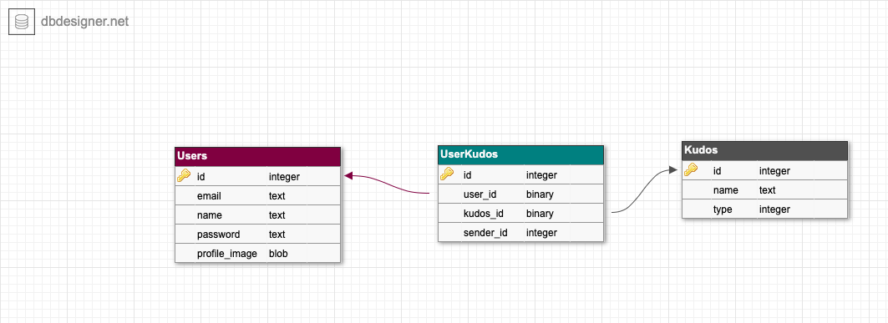

# Projeto BBB Kudos

----

### Versões das bibliotecas

Ruby: 2.6.3

Rails: 6.0.3.1

### Modelo do BD


### Instalação do projeto
```
$ git clone
```

### Rodando o projeto

```
$ bundle install
$ rails db:create db:migrate db:seed
$ rails s
```
